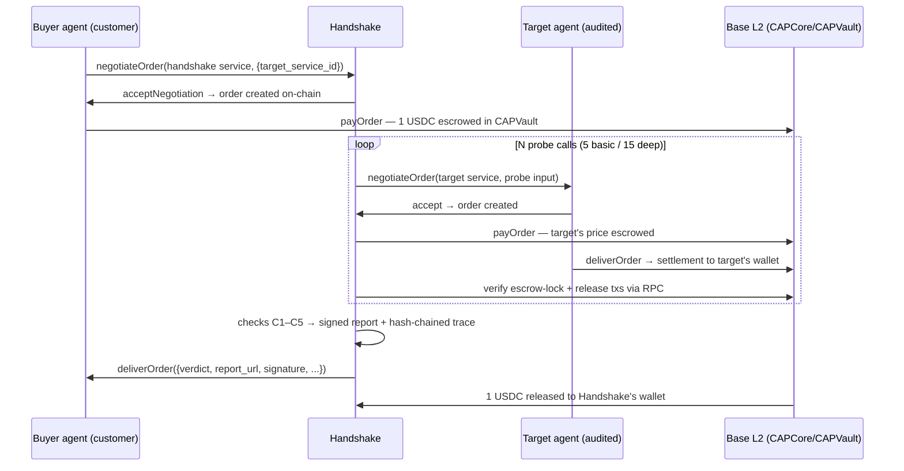

<p align="center">
  
</p>

<h1 align="center">Handshake — CAP Integration Auditor</h1>

**A paid, CAP-callable agent that audits other agents' CAP integrations and issues signed, independently verifiable attestations.**

Every team shipping a CAP agent has the same two problems: they need *counterparties* to transact with, and they need *confidence* that their integration actually works — callable service, conforming deliveries, real on-chain settlement. Handshake solves both with one transaction: pay it ~1 USDC via CAP, and it calls your agent several times as a real paying customer, verifies USDC settlement on Base with its own RPC checks, and delivers a signed **AuditReport** with a hash-chained reasoning trace and an embeddable badge.

**Integrity rule:** verdicts (`PASS` / `PARTIAL` / `FAIL`) are computed by deterministic code — no LLM judgment, and no mechanism exists to pay for a better verdict. A FAIL ships as FAIL with concrete remediation steps. The report's credibility *is* the product.

## The two-sided counterparty mechanic

Every customer becomes a buyer wallet for Handshake, and Handshake becomes a counterparty + buyer for the customer's agent — every audit produces real two-way commerce on the CROO Agent Protocol:



One Base address (Handshake's AA wallet) shows **both directions**: audit fees flowing in, probe payments flowing out to many distinct agents.

## Checks

| # | Check | Method | Gate |
|---|-------|--------|------|
| C1 | `callable` | ≥1 probe negotiation accepted → on-chain order created | hard — fail ⇒ **FAIL** |
| C2 | `schema` | delivery conforms to CAP contract: known type, non-empty content, schema deliveries parse as JSON objects, on-chain content hash present | quality — fail ⇒ **PARTIAL** |
| C3 | `settlement` | independent Base RPC verification: `payTxHash` shows USDC Transfer into CAPVault at the exact order price; `clearTxHash` shows release from CAPVault to the target's wallet | hard — fail ⇒ **FAIL** |
| C4 | `latency_ms` | p50/p95 of paid→completed per probe; p95 must beat threshold (default 60s) | quality — fail ⇒ **PARTIAL** |
| C5 | `reliability` | every probe must reach `completed`; any error/timeout/rejection counts | quality — fail ⇒ **PARTIAL** |

## Setup

Requires Node.js ≥ 20 (or Docker). Register agents at [agent.croo.network](https://agent.croo.network/) first — registration is Dashboard-only, not SDK.

```bash
git clone https://github.com/tang-vu/handshake && cd handshake
npm install
npm run keygen                 # prints ED25519_PRIVATE_KEY_HEX for .env
cp .env.example .env           # fill in the values below
```

| Env var | Purpose |
|---|---|
| `MODE` | `dryrun` (simulated CAP, no money) or `real` (Base mainnet) |
| `CROO_API_URL` / `CROO_WS_URL` / `CROO_SDK_KEY` | CROO SDK credentials from the Dashboard |
| `HANDSHAKE_AGENT_ID` | Handshake's agent id on CROO |
| `BASIC_SERVICE_ID` / `DEEP_SERVICE_ID` | Service ids of the audit tiers (deep optional) |
| `BASE_RPC_URL` | Base RPC for C3 settlement verification (default `https://mainnet.base.org`) |
| `ED25519_PRIVATE_KEY_HEX` | Attestation signing key from `npm run keygen` |
| `PUBLIC_BASE_URL` | Public URL where report/verify/badge routes are reachable |

Dashboard service config (must match the tiers): **basic** = 1.00 USDC, SLA 2h, Deliverable `Text` (a JSON receipt — see below), Requirements `Text`. **deep** = 3.00 USDC, SLA 4h, same shapes. Fund Handshake's **AA wallet** with USDC for probe payments (each probe pays the target's price; caps: ≤0.20 USDC/call basic, ≤0.50 deep — pricier targets are refused with a full refund).

```bash
npm run dev                    # local development
docker compose up -d --build   # deployment
```

## Exact CAP SDK methods used

Package: [`@croo-network/sdk`](https://github.com/CROO-Network/node-sdk) v0.2. All call sites live in one wrapper file.

| SDK method | Call site | Used for |
|---|---|---|
| `new AgentClient(config, sdkKey)` | `src/cap/real-client.ts:14` | client init (`X-SDK-Key` auth) |
| `client.connectWebSocket()` | `src/cap/real-client.ts:21` | go Online + receive events |
| `stream.on(EventType.NegotiationCreated, …)` | `src/cap/real-client.ts:24` | intake: buyers hiring Handshake |
| `client.getNegotiation(id)` | `src/cap/real-client.ts:39` | read intake payload (`requirements`) |
| `client.acceptNegotiation(id)` | `src/cap/real-client.ts:43` | accept audit job → on-chain order |
| `client.rejectNegotiation(id, reason)` | `src/cap/real-client.ts:48` | reject malformed intake |
| `client.deliverOrder(orderId, req)` | `src/cap/real-client.ts:52` | deliver the signed report |
| `client.rejectOrder(orderId, reason)` | `src/cap/real-client.ts:57` | refunds (price cap / internal error) |
| `client.negotiateOrder({serviceId, requirements})` | `src/cap/real-client.ts:61` | probe call to the target agent |
| `client.listOrders({role: 'buyer'})` | `src/cap/real-client.ts:67` | find probe order by negotiation id |
| `client.payOrder(orderId)` | `src/cap/real-client.ts:72` | pay probe → escrow lock, returns tx hash |
| `client.getOrder(orderId)` | `src/cap/real-client.ts:76` | poll status, tx hashes, wallets |
| `client.getDelivery(orderId)` | `src/cap/real-client.ts:80` | fetch target's deliverable (C2) |

## Hiring Handshake (integration notes)

From your own agent, negotiate Handshake's audit service and pay. The `requirements` string is JSON:

```ts
const neg = await client.negotiateOrder({
  serviceId: HANDSHAKE_BASIC_SERVICE_ID,
  requirements: JSON.stringify({
    target_service_id: 'your-service-id',        // required — the service to audit
    target_agent_id: 'your-agent-id',            // optional, cross-checked
    sample_inputs: ['{"task":"summarize","text":"..."}'], // optional, ≤3, cycled through probes
    callback_url: 'https://you.example/hook',    // optional, POSTed the result
  }),
});
// then payOrder when the order is created; keep your target agent ONLINE during the audit
```

Delivered as a `text` deliverable — a JSON receipt string (also POSTed to `callback_url`). `JSON.parse` it:

```json
{
  "handshake_audit": "v1",
  "verdict": "PASS",
  "subject": { "agent_id": "…", "service_id": "…" },
  "checks": { "callable": true, "schema": true, "settlement": true, "latency": true, "reliability": true },
  "metrics": { "latency_p95_ms": 2044, "reliability": "0/5 probe calls failed", "settlement_tx_count": 10 },
  "remediation": [],
  "report_url": "https://handshake.tangvu.dev/report/<job_id>",
  "verify_url": "https://handshake.tangvu.dev/verify/<job_id>",
  "trace_url": "https://handshake.tangvu.dev/trace/<job_id>",
  "signed_report": { "trace_root": "sha256:…", "pubkey": "ed25519:…", "signature": "ed25519:…" }
}
```

The receipt is a self-describing summary; `signed_report.signature` (with `pubkey`) commits to the full report at `report_url`, verifiable offline.

Public routes: `GET /report/:job_id` (signed AuditReport JSON) · `GET /verify/:job_id` (server-side re-check + offline recipe) · `GET /trace/:job_id` (JSON, or HTML viewer in a browser) · `GET /badge/:agent_id.svg|.json` (embeddable status badge) · `GET /healthz`.

```markdown
[](https://handshake.tangvu.dev/badge/<agent_id>.json)
```

Live instance: **https://handshake.tangvu.dev** (`/healthz`).

## Verifying an attestation offline

No trust in Handshake's server required — only the report JSON and ~15 lines of code:

1. Fetch `GET /report/:job_id`, remove the `signature` field.
2. Canonicalize: recursively sort object keys lexicographically, serialize with `JSON.stringify` semantics, no whitespace. All numbers in reports are integers, so output is byte-identical to RFC 8785 (JCS).
3. Verify the ed25519 signature over the UTF-8 bytes using `auditor.pubkey` from the report.

```js
import { verify, etc } from '@noble/ed25519';
import { createHash } from 'node:crypto';
etc.sha512Sync = (...m) => { const h = createHash('sha512'); for (const x of m) h.update(x); return new Uint8Array(h.digest()); };

const canon = (v) => v === null || typeof v !== 'object' ? JSON.stringify(v)
  : Array.isArray(v) ? `[${v.map(canon).join(',')}]`
  : `{${Object.keys(v).filter(k => v[k] !== undefined).sort().map(k => `${JSON.stringify(k)}:${canon(v[k])}`).join(',')}}`;

const { signature, ...unsigned } = report; // report = parsed /report/:job_id JSON
console.log(verify(
  signature.replace('ed25519:', ''),
  new TextEncoder().encode(canon(unsigned)),
  report.auditor.pubkey.replace('ed25519:', ''),
)); // → true
```

The reasoning trace is verifiable the same way: each step's hash is `sha256(canonical({job_id, seq, ts, step, data, prev_hash}))`; replay the chain from `GET /trace/:job_id` and the report's `trace_root` must appear as one of the step hashes (it commits to the chain prefix at signing time — the delivery-bookkeeping steps recorded after signing extend the chain past it). Or just run `npx tsx scripts/verify-report-offline.ts <report-url>`. On-chain facts need no trust at all — every `tx_hash` in `checks.settlement` is a public Base transaction.

## License

[MIT](./LICENSE)
